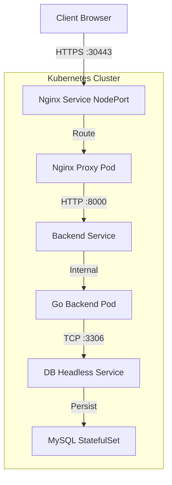

# 🚀 3-Tier Blog Application on Kubernetes (Go + MySQL + Nginx)

A production-ready three-tier web application demonstrating containerized microservices architecture. This project deploys a Go backend, a MySQL database, and an Nginx reverse proxy using **Kubernetes (Minikube)**.

## 📋 Table of Contents
- [Overview](#-overview)
- [Architecture](#-architecture)
- [Technologies Used](#%EF%B8%8F-technologies-used)
- [Project Structure](#-project-structure)
- [Prerequisites](#-prerequisites)
- [Kubernetes Deployment](#%EF%B8%8F-kubernetes-deployment)
- [Accessing the Application](#-accessing-the-application)
- [Challenges & Troubleshooting](#-challenges--troubleshooting)

---

## 📖 Overview
This project implements a **3-tier blog API system** consisting of:
* **Backend API (Go):** Serves REST responses with blog post titles.
* **Database (MySQL 5.7):** Persistent storage using StatefulSet.
* **Reverse Proxy (Nginx):** Exposes the API over HTTPS with SSL/TLS termination.

---

## 🏗 Architecture


---
## 🛠️ Technologies Used
| Component | Technology | Version |
|-----------|------------|---------|
| **Backend** | Go (Golang) | 1.18 |
| **Database** | MySQL | 5.7 |
| **Proxy** | Nginx | Latest |
| **Orchestration** | Kubernetes (Minikube) | Latest |
| **Containerization** | Docker | 20.10+ |

---

## 📂 Project Structure
```project/
├── backend/
│   ├── Dockerfile              # Multi-stage build for Go app
│   ├── main.go                 # Backend API logic
│   └── go.mod                  # Dependencies
│
├── nginx/
│   ├── Dockerfile              # Nginx container with SSL certs
│   ├── nginx.conf              # Proxy configuration
│   └── generate-ssl.sh         # Script for self-signed certs
│
├── K8S/
│   ├── backend_deployment.yaml     # Backend Deployment
│   ├── backend_service.yaml        # ClusterIP Service
│   ├── db_statefulset.yaml         # MySQL StatefulSet
│   ├── db_headless_service.yaml    # Headless Service
│   ├── db-data-pv.yaml             # Persistent Volume
│   ├── db-data-pvc.yaml            # Persistent Volume Claim
│   ├── db-secret.yaml              # Secrets (Encoded)
│   ├── proxy_deployment.yaml       # Nginx Deployment
│   ├── proxy_nodeport.yml          # NodePort Service (30443)
│   └── nginx-certs.yaml            # TLS Secrets
│
└── README.md
```
---
## ✅ Prerequisites
- Docker Engine installed.
- Minikube installed and running.
- kubectl CLI tool.
---
## ☸️ Kubernetes Deployment
Step 1: Clone and Prepare
```bash
git clone <your-repo-url>
cd project
```
Step 2: Build Docker Images in Minikube
We use the Minikube Docker daemon to build images locally so Kubernetes can find them.
```bash
eval $(minikube docker-env)
docker build -t my-go-backend:v1 ./backend
# (Nginx image is built similarly or pulled)
docker build -t my-custom-nginx:v1
```
Step 3: Apply Kubernetes Manifests
We deploy the infrastructure in specific order (Storage -> DB -> Backend -> Proxy).
```bash
# 1. Storage & Secrets
kubectl apply -f K8S/db-secret.yaml
kubectl apply -f K8S/db-data-pv.yaml
kubectl apply -f K8S/db-data-pvc.yaml

# 2. Database
kubectl apply -f K8S/db_headless_service.yaml
kubectl apply -f K8S/db_statefulset.yaml

# 3. Backend App
kubectl apply -f K8S/backend_service.yaml
kubectl apply -f K8S/backend_deployment.yaml

# 4. Nginx Proxy
kubectl apply -f K8S/proxy_deployment.yaml
kubectl apply -f K8S/proxy_nodeport.yml

Step 4: Verify Deployment
Check if all pods are running:
```bash
kubectl get all
```
Running Status: 


---

